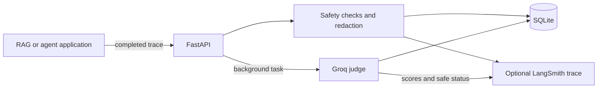

# LLM Reliability, Evaluation & Safety Platform

## Project overview

This service receives completed LLM application traces and adds a reliability layer around them. It does not generate the original answer. It validates and sanitizes each trace, stores it in SQLite, evaluates retrieval quality with one Groq judge request, and can export sanitized telemetry and scores to LangSmith.

## Problem statement

LLM applications need more than a successful HTTP response. Teams also need to know whether an answer is grounded in retrieved context, relevant to the question, safe to retain, and observable when something fails. This project provides a small reference implementation of that post-response workflow.

## Features

- Strict FastAPI and Pydantic trace validation
- Deterministic detection and redaction for common PII and secret patterns
- Prompt-injection pattern detection
- SQLite persistence with summaries and pagination
- One structured Groq evaluation request per trace
- Optional LangSmith traces and score feedback
- Credential-free unit tests and a Promptfoo runtime-safety configuration
- A single Python 3.12 Docker image

## Architecture



## Request lifecycle

With evaluation enabled:

```text
submit trace -> validate -> safety checks -> store as pending -> HTTP 202
             -> background Groq evaluation -> update SQLite -> LangSmith feedback
```

With `EVALUATION_ENABLED=false`, the sanitized trace is stored with status `skipped` and no judge request is made.

FastAPI `BackgroundTasks` are suitable for this single-instance demonstration, but tasks may be lost if the process stops. A production system would use a durable queue.

## Technology stack

Python 3.12, FastAPI, Pydantic, built-in `sqlite3`, Groq, LangSmith, Promptfoo, pytest, Docker, and `uv`.

## File structure

```text
app/
  main.py            API models, endpoints, and request lifecycle
  database.py        SQLite operations
  evaluator.py       Groq judge and validated scores
  safety.py          Detection and redaction rules
  observability.py   Optional LangSmith integration
tests/test_app.py
security/promptfooconfig.yaml
examples/submit_trace.py
data/.gitkeep
main.py
Dockerfile
pyproject.toml
uv.lock
.env.example
README.md
LICENSE
```

`LEARNING.md` is a private, ignored local study guide and is intentionally absent from the public structure.

## Local setup

```bash
uv sync
cp .env.example .env
```

Set the environment variables in your shell, then run:

```bash
uv run uvicorn main:app --reload
```

The API documentation is available at `http://localhost:8000/docs`.

## Environment configuration

| Variable | Default | Purpose |
| --- | --- | --- |
| `DATABASE_PATH` | `data/traces.db` | SQLite file location |
| `GROQ_API_KEY` | empty | Groq credential; required when evaluation is enabled |
| `GROQ_JUDGE_MODEL` | `openai/gpt-oss-20b` | Judge model |
| `GROQ_TIMEOUT_SECONDS` | `30` | Provider timeout |
| `MAX_CONTEXT_CHARACTERS` | `6000` | Maximum combined context sent to the judge |
| `EVALUATION_ENABLED` | `true` | Evaluate every trace or skip all evaluation |
| `LANGSMITH_ENABLED` | `false` | Enable sanitized telemetry export |
| `LANGSMITH_API_KEY` | empty | LangSmith credential |
| `LANGSMITH_PROJECT` | `llm-reliability-platform` | LangSmith project name |

Never commit `.env` or real credentials.

## API examples

Submit a completed trace:

```bash
curl -X POST http://localhost:8000/traces \
  -H 'Content-Type: application/json' \
  -d '{
    "application": "demo-rag",
    "query": "What is the battery warranty?",
    "answer": "The battery warranty is eight years.",
    "contexts": ["The vehicle battery is covered for eight years or 160000 km."],
    "model": "example-model",
    "latency_ms": 1250,
    "input_tokens": 320,
    "output_tokens": 45
  }'
```

Use the returned ID with `GET /traces/{trace_id}`. Other endpoints are `GET /traces?limit=20&offset=0`, `GET /summary`, and `GET /health`. The example client submits and polls a trace:

```bash
uv run python examples/submit_trace.py
```

## Testing instructions

Tests use a temporary SQLite database, fake evaluator, and mocked LangSmith client. They require no network or credentials.

```bash
uv run pytest
uv run ruff check .
```

## Promptfoo instructions

Start the API with evaluation disabled, then run Promptfoo from the repository root:

```bash
EVALUATION_ENABLED=false LANGSMITH_ENABLED=false uv run uvicorn main:app
promptfoo eval -c security/promptfooconfig.yaml --output promptfoo-output/results.json
```

The current configuration tests this platform's detection and redaction behavior for injection, prompt extraction, PII, jailbreak-style overrides, and off-topic traces. The platform is not a chatbot. A later configuration can red-team the connected RAG and multi-agent applications. No fabricated results are included.

## Docker instructions

```bash
docker build -t llm-reliability-platform .
docker run --rm -p 8000:8000 \
  -e EVALUATION_ENABLED=false \
  -e LANGSMITH_ENABLED=false \
  -v "$(pwd)/data:/app/data" \
  llm-reliability-platform
```

Pass secrets as runtime environment variables; they are never baked into the image.

## Security and privacy behaviour

Safety checks run before persistence, evaluation, telemetry, or application logging. Detected email addresses, phone numbers, credit-card-like numbers, and obvious secrets are replaced with explicit redaction placeholders. Only sanitized content is stored or exported, and API users see safe provider error categories rather than raw exceptions.

These regex rules are a baseline. They can produce false positives and can be bypassed by unusual formatting or obfuscation; they are not a complete data-loss-prevention or security system.

## Current limitations

- Background tasks are not durable across process termination.
- SQLite and in-process work target a single-instance demonstration.
- LLM-as-judge scores can be inconsistent and should be calibrated against human review.
- Rule-based safety checks do not understand every language or encoding.
- There is no authentication, authorization, caching, or retention policy.
- LangSmith export is best-effort; failures do not block local processing.

## Future RAG and agent integration

Connected RAG services and agents can submit traces after producing their answers. Future work can add authenticated ingestion, application-specific evaluation datasets, durable workers, judge calibration, simple evaluation caching, retention controls, and Promptfoo targets that directly red-team those upstream systems.
